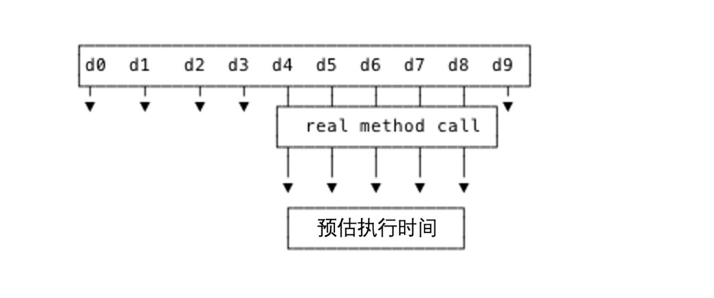
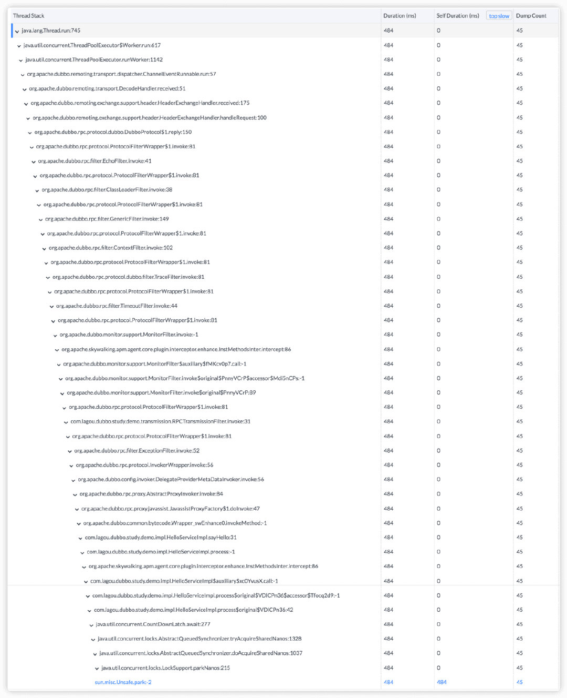

- 作者：[吴晟](https://github.com/wu-sheng)，[刘晗](https://github.com/mrproliu)
- [原文地址](https://www.infoq.cn/article/CWUOl1JA0EyXw0CxQ4Zm)

在本文中，我们详细介绍了代码级的性能剖析方法，以及我们在 Apache SkyWalking 中的实践。希望能够帮助大家在线定位系统性能短板，缓解系统压力。

## 分布式链路追踪的局限性

在传统的监控系统中，我们如果想要得知系统中的业务是否正常，会采用进程监控、日志收集分析等方式来对系统进行监控。当机器或者服务出现问题时，则会触发告警及时通知负责人。通过这种方式，我们可以得知具体哪些服务出现了问题。但是这时我们并不能得知具体的错误原因出在了哪里，开发人员或者运维人员需要到日志系统里面查看错误日志，甚至需要到真实的业务服务器上查看执行情况来解决问题。

如此一来，仅仅是发现问题的阶段，可能就会耗费相当长的时间；另外，发现问题但是并不能追溯到问题产生具体原因的情况，也常有发生。这样反反复复极其耗费时间和精力，为此我们便有了基于分布式追踪的 APM 系统。

通过将业务系统接入分布式追踪中，我们就像是给程序增加了一个放大镜功能，可以清晰看到真实业务请求的整体链路，包括请求时间、请求路径，甚至是操作数据库的语句都可以看得一清二楚。通过这种方式，我们结合告警便可以快速追踪到真实用户请求的完整链路信息，并且这些数据信息完全是持久化的，可以随时进行查询，复盘错误的原因。

然而随着我们对服务监控理解的加深，我们发现事情并没有那么简单。在分布式链路追踪中我们有这样的两个流派：代码埋点和字节码增强。无论使用哪种方式，底层逻辑一定都逃不过面向切面这个基础逻辑。因为只有这样才可以做到大面积的使用。这也就决定了它只能做到框架级别和 RPC 粒度的监控。这时我们可能依旧会遇到程序执行缓慢或者响应时间不稳定等情况，但无法具体查询到原因。这时候，大家很自然的会考虑到增加埋点粒度，比如对所有的 Spring Bean 方法、甚至主要的业务层方法都加上埋点。但是这种思路会遇到不小的挑战：

第一，增加埋点时系统开销大，埋点覆盖不够全面。通过这种方式我们确实可以做到具体业务场景具体分析。但随着业务不断迭代上线，弊端也很明显：大量的埋点无疑会加大系统资源的开销，造成 CPU、内存使用率增加，更有可能拖慢整个链路的执行效率。虽然每个埋点消耗的性能很小，在微秒级别，但是因为数量的增加，甚至因为业务代码重用造成重复埋点或者循环使用，此时的性能开销已经无法忽略。

第二，动态埋点作为一项埋点技术，和手动埋点的性能消耗上十分类似，只是减少的代码修改量，但是因为通用技术的特别，上一个挑战中提到的循环埋点和重复使用的场景甚至更为严重。比如选择所有方法或者特定包下的所有方法埋点，很可能造成系统性能彻底崩溃。

第三，即使我们通过合理设计和埋点，解决了上述问题，但是 JDK 函数是广泛使用的，我们很难限制对 JDK API 的使用场景。对 JDK 过多方法、特别是非 RPC 方法的监控会造成系统的巨大延迟风险。而且有一些基础类型和底层工具类，是很难通过字节码进行增强的。当我们的 SDK 使用不当或者出现 bug 时，我们无法具体得知真实的错误原因。

## 代码级性能剖析方法

### 方法介绍

基于以上问题，在系统性能监控方法上，我们提出了**代码级性能剖析**这种在线诊断方法。这种方法基于一个高级语言编程模型共性，即使再复杂的系统，再复杂的业务逻辑，都是基于线程去进行执行的，而且多数逻辑是在单个线程状态下执行的。

**代码级性能剖析**就是利用方法栈快照，并对方法执行情况进行分析和汇总。并结合有限的分布式追踪 span 上下文，对代码执行速度进行估算。

性能剖析激活时，会对指定线程周期性的进行线程栈快照，并将所有的快照进行汇总分析，如果两个连续的快照含有同样的方法栈，则说明此栈中的方法大概率在这个时间间隔内都处于执行状态。从而，通过这种连续快照的时间间隔累加成为估算的方法执行时间。时间估算方法如下图所示：



在上图中，d0-d10 代表 10 次连续的内存栈快照，实际方法执行时间在 d3-d4 区间，结束时间在 d8-d9 之间。性能剖析无法告诉你方法的准确执行时间，但是他会估算出方法执行时间为 d4-d8 的 4 个快照采集间隔时间之和，这已经是非常的精确的时间估算了。

而这个过程因为不涉及代码埋点，所以自然性能消耗是稳定和可控的，也无需担心是否被埋点，是否是 JDK 方法等问题。同时，由于上层已经在分布式追踪之下，性能剖析方法可以明确地确定分析开始和结束时间，减少不必要的性能开销。

性能剖析可以很好的对线程的堆栈信息进行监控，主要有以下几点优势：

1. 精确的问题定位，直接到代码方法和代码行；
1. 无需反复的增删埋点，大大减少了人力开发成本；
1. 不用承担过多埋点对目标系统和监控系统的压力和性能风险；
1. 按需使用，平时对系统无消耗，使用时的消耗稳定可能。

### SkyWalking 实践实例

我们首先在 Apache SkyWalking APM 中实现此技术方法，下面我们就以一个真实的例子来说明此方法的执行效果。

```java
final CountDownLatchcountDownLatch= new CountDownLatch(2);
threadPool.submit(new Task1(countDownLatch));
threadPool.submit(new Task2(countDownLatch));
try {
   countDownLatch.await(500, TimeUnit.MILLISECONDS);
} catch (InterruptedExceptione) {
}
```

这是我们故意加入的问题代码，我们使用 CountDownLanth 设置了两个任务完成后方法执行结束，Task1 和 Task2 是两个执行时间不稳定的任务，所以主任务也会执行速度不稳定。但对于运维和监控团队来说，很难定位到这个方法片段。

针对于这种情况，我们看看性能剖析会怎样直接定位此问题。


上图所示的就是我们在进行链路追踪时所看到的真实执行情况，其中我们可以看到在 service/processWithThreadPool 执行速度缓慢，这正是我们植入问题代码的方法。此时在这个调用中没有后续链路了，所以并没有更细致的原因，我们也不打算去 review 代码，从而增加新埋点。这时，我们可以对 HelloService 进行性能剖析，并执行只剖析响应速度大于 500 毫秒的请求。

注意，指定特定响应时间的剖析是保证剖析有效性的重要特性，如果方法在平均响应时间上已经出现问题，往往通过分布式链路可以快速定位，因为此时链路总时间长，新埋点带来的性能影响相对可控。但是方法性能抖动是不容易用新增埋点来解决的，而且往往只发生在生产环境。



上图就是我们进行性能剖析后的真实结果图。从左到右分别表示：栈帧名称、该栈帧总计耗时（包含其下面所有自栈帧）、当前栈帧自身耗时和监控次数。我们可以在最后一行看到，线程卡在了 sun.misc.Unsafe.park 中了。如果你熟悉 Java 就可以知道此时进行了锁等待，我们继续按照树的结构向上推，便可以看到线程真正是卡在了 CountDownLatch.await 方法中。

### 方法局限性

当然任何的方法都不是万能的，性能剖析也有一些局限性。

第一， 对于高频反复执行的方法，如循环调用，可能会误报为缓慢方法。但这并不是大问题，因为如果反复执行的耗时较长，必然是系统需要关注的性能瓶颈。

第二， 由于性能栈快照有一定的性能消耗，所以采集周期不宜过密，如 SkyWalking 实践中，不支持小于 10ms 的采集间隔。所以如果问题方法执行时间过小（比如在 10 毫秒内波动），此方法并不适用。我们也再此强调，**方法论和工具的强大，始终不能代替程序员**。