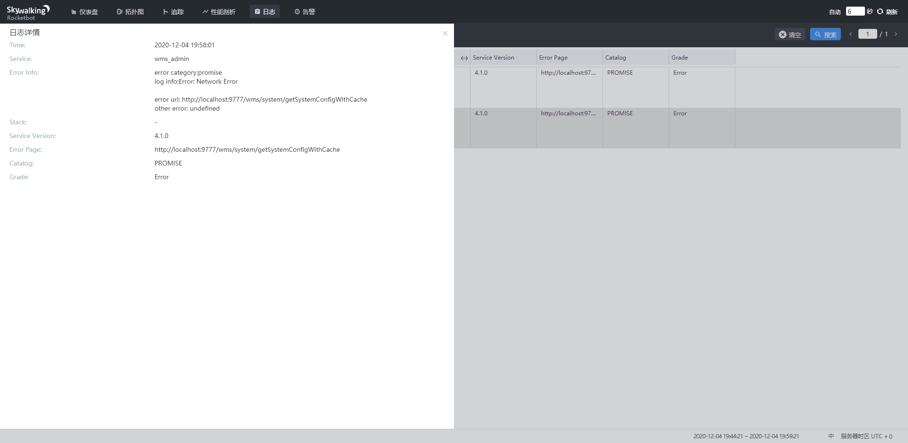
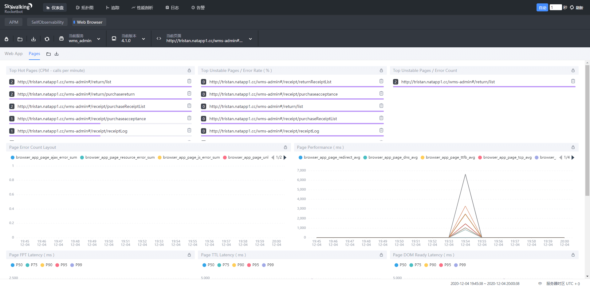

首先我们得明白前端项目是通过Nginx代理出来, 我们得修改Nginx添加SkyWalking-OAP端点, 让SkyWalking-OAP端点处于前端项目的项目根目录, Nginx案例如下(Ingress-Nginx暂略)

```
		location /browser {
			proxy_pass http://<your_skywalking_oap_ip>:12800;
			proxy_set_header Host      $host;
			proxy_set_header X-Real-IP $remote_addr;
		}
```

前端项目需要安装一下SkyWalking依赖:

```
npm install skywalking-client-js --save
```

每一个项目的package.json中的name都要用项目名称且不能与其他项目重复, version尽量保持有意义

在路由/公共js中调整添加如下内容

注意: router.beforeEach在实际项目中最好只声明一次

```
import ClientMonitor from 'skywalking-client-js'

const router = createRouter() // 在router创建之后
const package_json = require('../../package.json')
const set_skywalking_monitor = async function(to, from, next) {
  const skywalking_config = {
    service: package_json.name,
    serviceVersion: package_json.version,
    pagePath: location.href.substring(0, location.href.indexOf('#') + 1) + to.path,
    jsErrors: true,
    apiErrors: true,
    resourceErrors: true,
    useFmp: true,
    enableSPA: true,
    autoTracePerf: true
  }
  try {
    ClientMonitor.register(skywalking_config)
    ClientMonitor.setPerformance(skywalking_config)
  } catch (e) {
    console.log(e)
  }
  next()
}
router.beforeEach(set_skywalking_monitor)
```

效果:

目前能看到各个系统的前端页面访问记录的时间

控制台的打印日志






谢谢观看, 后续我会在SkyWalking告警这块写更多实战文章