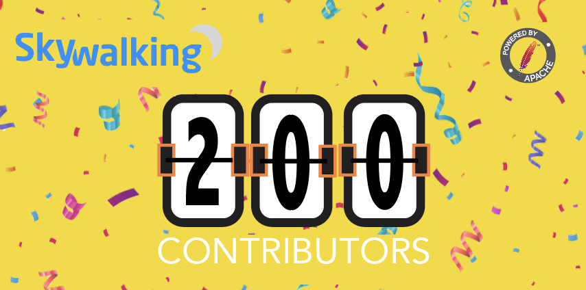

# SkyWalking hits 200 contributors mark

- Auther: Wu Sheng, tetrate.io, SkyWalking original creator, SkyWalking V.P.
- [GitHub](https://github.com/wu-sheng), [Twitter](https://twitter.com/wusheng1108), [Linkedin](https://www.linkedin.com/in/wusheng1108)

SkyWalking project provides distributed tracing, topology map analysis, service mesh telemetry analysis, metrics analysis and super cool visualization
targeting distributed system in k8s or traditional VM deployment.

The project is widely used in Alibaba, Huawei, Tencent, DiDi, xiaomi, Pingan, China top 3 telecom companies(China Mobile, China telecom, China Unicom), Airlines, Banks and more. Have over 140 company users listing on our [powered by](https://github.com/apache/skywalking/blob/master/docs/powered-by.md) page.

Today, we welcome and celebrate for over 200 code contributors of our single main repo. We have passed 200 contributors and 200 code contributors long time ago, even can't set an accurate date. But this time, we could have the exact date. **Jan. 20th 2020**.

At this great moment, I would like to share SKyWalking 4 years open source journey.

I wrote the first line at Nov 1st, 2015, for guiding people to understand distributed system, as at that time, micro-service and distributed architecture became popular.
In the first 2 years, I never thought it would become a such big and active community, even I didn't think it would be a really open source project.
The target used to be teaching about distributed tracing and analysis only.
With in 2015-2017 to be a normal and obscurity open source project, 
people still showed up, asked questions, tried to improve the project, I got several invitations to share the project at local meetups.
All these made me realized people really need a good open source APM project. It was still a blank.

At 2017, I decided to dedicate as much as possible to make the project successful, even made this as my day job. But to be honest, I had no clue about how to do that, because at 2017's China, there was rare to have this kind of job.
So, I began to ask friends around me, `Do you want to collaborate the open source APM with me?`. Clearly, most are **NO**, as people are busy, but 2 of them accepted to help, Xin Zhang and Yongsheng Peng. That was the time we built the SkyWalking 3.x. We shared the 3.2 release at GOPS Shanghai, China. It became the first adoption version using in the production environment. 
Comparing to today's SkyWalking, it just liked a prototype and toy, but it had the same tracing design, protocol and analysis method. 

In the whole year of 2017, the contributor team of the project has 15-20, but we only have limited time on the project. Then I began to consider bringing the project into worldwide and top-level the open source foundation. Appriciate our initial incubator mentors, Michael Semb Wever, William Jiang, Luke Han, this really worked.
In 2017, SkyWalking joined the Apache Incubator, and keeps following the Apache Way to build community. More contributors joined the community.
With more people spend time on the project collaborations, including codes, tests, blogs, conference talks, books and use the project. The chemical reaction happens. New developers begin to provide bug fix, new feature requirement and new proposal. 
At the moment of the graduation around Mar. 2019, the project had 100 contributors. Right now, in 9 months, it hits the 200 super quickly. They enhance th project and extend the project to the landscape we never imaged, 5 popular language agents, service mesh adoption, CLI tool, super cool visualization. We are even moving on thread profiling, browser performance and nginx tracing NOW.

In the whole 4+ years open source journey, we have supports from the people in the tracing open source community around the world, including Adrian Cole, William Jiang, Luke Han, Michael Semb Wever, Ben Sigelman, Jonah Kowall and more, and foundations' help, especially Apache Software Foundation and Cloud Native Computing Foundation.
Our contributors also have their supports from their employers, as far as I known, Alibaba, Huawei, China Mobile, ke.com, DaoCloud, Lizhi.fm, Yonghui Super market, dangdang.com. Personally, I have supports from my employers, [tetrate.io](https://www.tetrate.io/), Huawei, OneAPM. 

Thanks our over 200 contributors and companies behind them. You make this magic happens.
